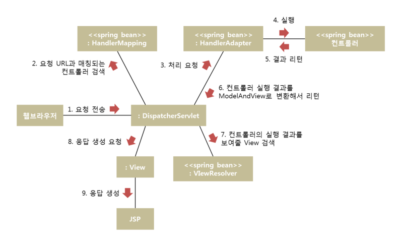

# Spring-Study
<strong>스프링 mvc 동작 원리</strong>  
  

* <strong>Servlet</strong>  
클라이언트가 어떠한 요청을 하면 그에 대한 결과를 전송해주는 역할  
  
* <strong>HandlerMapping</strong>  
클라이언트의 요청경로를 통해 처리할 컨트롤러를 찾아 서블릿에  
    
* <strong>HandlerAdapter</strong>  
@Controller, Controller인터페이스(스프링 2.5에서 주로 사용), HttpRequestHandler인터페이스(특수목적으로 사용)  
위 세가지를 동일한 방식으로 처리하기 위한 빈  
컨트롤러 요청을 처리하고 결과를 ModelAndView 객체로 변환해서 서블릿에 리턴
